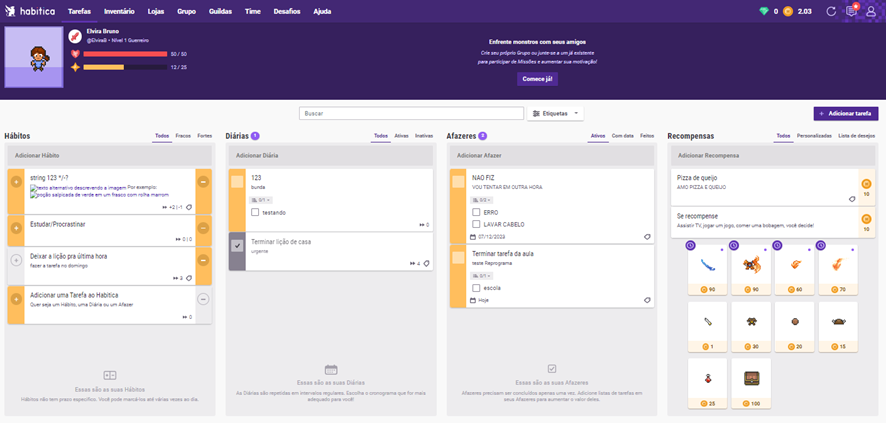
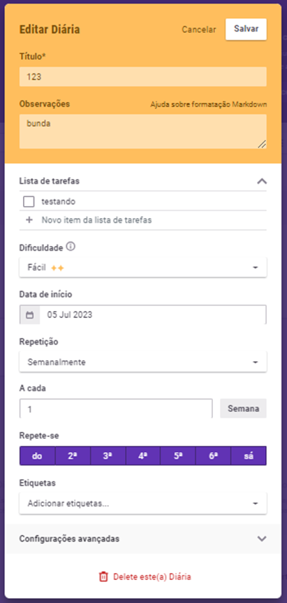
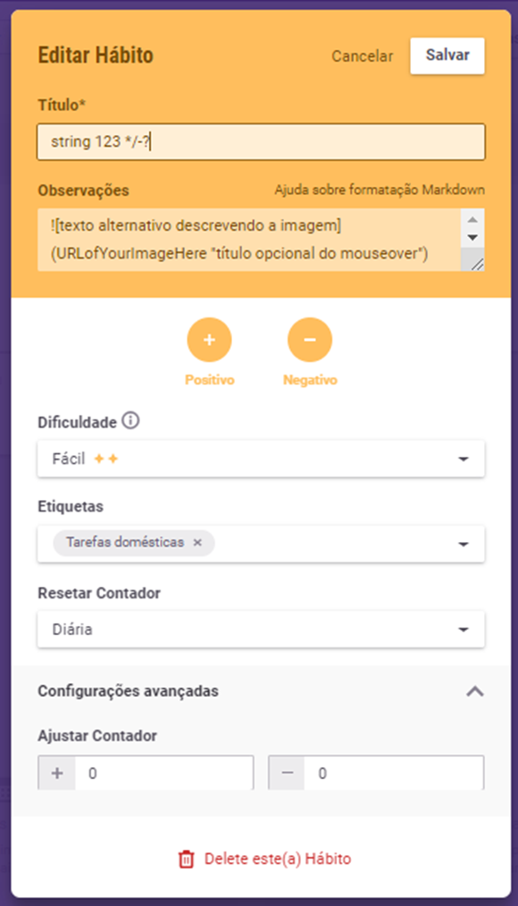
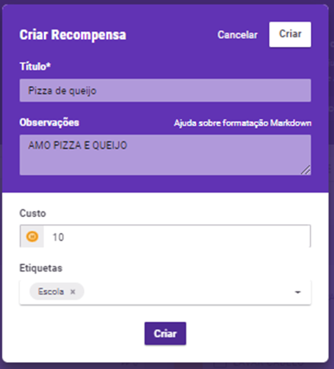
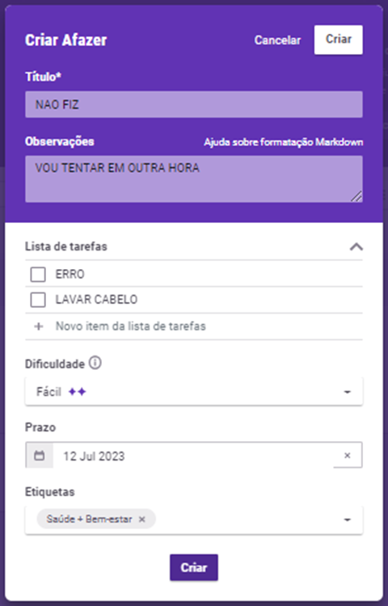

Me cadastrei no site HABITICA, acredito ser um ótimo método de organização pessoal e profissional para viciados em games e RPG (D&D)

No cadastro inicial, para login, o site aprovou uma idade acima de 200 anos (coloquei no exemplo que nasci em 1778), um erro de digitação (nesse caso proposital), comprometendo a integridade do banco de dados.

```Etapa 1: inserir tarefas
Primeiro, insira algumas tarefas. Você pode adicionar mais mais tarde à medida que pensa neles.



Adicionar tarefa: a escolha entre, Hábito, Diária, Afazer e Recompensa,  deve ser add no dashboard com status 200

Erro ao enviar qualquer outro tipo de atividade sem ser Hábito, Diária e Afazer, com status 404.


1a. Configurar tarefas
Insira as tarefas que você faz uma vez ou raramente na coluna de tarefas, uma de cada vez. Você pode clicar no lápis para editá-los e adicionar listas de verificação, datas de vencimento e muito mais!

1b. Configurar Diárias
Insira as atividades que você precisa fazer diariamente ou em um determinado dia da semana na coluna Diárias. Clique no ícone de lápis do item para 'editar' o(s) dia(s) da semana em que será devido. Você também pode vencê-lo repetidamente, por exemplo, a cada 3 dias.



Título e observações,  status 200 para qualquer tipo de entrada, sem restrições de palavras de baixo calão;

Na lista de tarefas, status code 200 para strings e números, com restrição de tamanho, cria um item checável, onde add pontos e recompensas em seu personagem.

Datas e repetições, somente com entradas específicas, outras entradas, erro 500.

Dificuldade: ajustado pelo jogador, de acordo com as entradas trivial, fácil, médio e difícil. Essas com status 200, outras entradas não são permitidas.
 “Dificuldade descreve o quão desafiador é um Hábito, Diária ou Afazer para você completar. Uma maior dificuldade resulta em maiores recompensas quando a Tarefa é concluída, mas também em um maior dano quando uma Diária não é realizada ou quando um Hábito negativo é clicado.”


1c. Crie hábitos
Insira os hábitos que deseja estabelecer na coluna Hábitos. Você pode editar o Hábito para mudá-lo para apenas um bom hábito (+) ou um mau hábito (-).



Título e observações,  status 200 para qualquer tipo de entrada, sem restrições de palavras de baixo calão;

Dificuldade: ajustado pelo jogador, de acordo com as entradas trivial, fácil, médio e difícil. Essas com status 200, outras entradas não são permitidas.

Resetar contador: ajustado pelo jogador, de acordo com as entradas diária, semanal ou mensal. Essas com status 200, outras entradas não são permitidas


1d. Configurar recompensas
Além das recompensas oferecidas no jogo, adicione atividades ou guloseimas que você deseja usar como motivação na coluna Recompensas. É importante dar uma pausa ou permitir alguma indulgência com moderação!
Bônus: se você precisar de inspiração sobre quais tarefas adicionar, consulte as páginas de hábitos de amostra, diárias de amostra, tarefas de amostra e recompensas de amostra.
```


Título e observações,  status 200 para qualquer tipo de entrada, sem restrições de palavras de baixo calão;

Custo: valor que deve ser retirado da suas conquistas ao resgatar uma recompensa.
Se valor maior que saldo de conquistas: Retornar 401 “não há saldo”
Se valor menor que saldo de conquistas: Retornar 200 ‘você foi recompensado e seu saldo é de (saldo – saque) aproveite’

AFAZERES



Título e observações,  status 200 para qualquer tipo de entrada, sem restrições de palavras de baixo calão;
Na lista de tarefas, status code 200 para strings e números, com restrição de tamanho, cria um item checável, onde add pontos e recompensas em seu personagem.

Dificuldade: ajustado pelo jogador, de acordo com as entradas trivial, fácil, médio e difícil. Essas com status 200, outras entradas não são permitidas.

Datas e repetições, somente com entradas específicas, outras entradas, erro 500.
